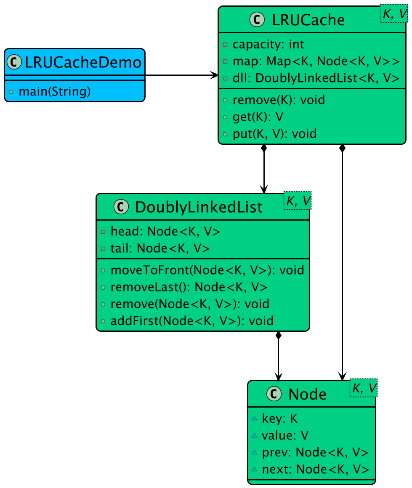

# LRU Cache — Engineered from First Principles

<div align="center">

[](https://isocpp.org/)
[](LICENSE)

**A high-performance, $\mathcal{O}(1)$ Least Recently Used (LRU) Cache built from the ground up in Modern C++ using an `unordered_map` and a custom doubly linked list.**

[Architecture](#️-architecture) • [Engineering Post-Mortem](#-engineering-post-mortem) • [Usage](#-usage)

</div>

---

## 🎯 Overview

This repository is an **engineering case study** in building low-level data structures from first principles. 

Instead of wrapping a standard library list, this project implements a **custom, memory-safe, templated Doubly Linked List**. It utilizes the **Sentinel (Dummy) Node pattern**, achieving zero-branch constant-time pointer surgeries ($\mathcal{O}(1)$) and eradicating the typical null-pointer edge cases that plague cache designs.

### Core Features
- ✅ **Pure $\mathcal{O}(1)$ operations:** Constant-time `get()`, `put()`, and LRU eviction.
- ✅ **Sentinel (Dummy) Node Architecture:** Permanently anchored `head` and `tail` nodes eliminate `if (nullptr)` edge-casing entirely.
- ✅ **Zero-Allocation Node Promotion:** Uses an in-place `Detach()` method to rewire pointers without triggering the `new`/`delete` heap allocator, resolving Use-After-Free vulnerabilities.
- ✅ **Template-driven:** Type-safe for any `K` (Key) and `V` (Value) pairings.
- ✅ **Rule of 5 Compliant:** Prevents shallow-copy double-free memory corruption.

---

## 🏗️ Architecture

The cache operates by coordinating two structures:
1. **`std::unordered_map<K, node<K, V>*>`**: Provides $\mathcal{O}(1)$ lookup from a Key directly to the node's memory address in the linked list.
2. **`linked_list<K, V>`**: A custom doubly-linked list maintaining strict MRU (Most Recently Used) to LRU (Least Recently Used) chronological order.

### System Components

The LRU Cache is built using three primary components working in concert:

```text
+---------------------------------------------------------+
|                      LRU Cache                          |
|  +----------------------+  +----------------------+     |
|  |   HashMap (O(1))     |  |  Doubly Linked List  |     |
|  |                      |  |                      |     |
|  |  Key -> Node*        |  |  [Head] <-> Node <-> |     |
|  |                      |  |          |           |     |
|  |  Fast Lookup         |  |        Node <-> [Tail]   |
|  +----------------------+  +----------------------+     |
|         ^                            ^                  |
|         |                            |                  |
|    Reference Nodes          Maintains LRU Order         |
+---------------------------------------------------------+
```

### Class Diagram



### 🧠 The Mental Model: Sentinel Nodes
Sentinel nodes act as permanent bookends for your data:
- **HEAD:** "I stand at the beginning. Always."
- **TAIL:** "I stand at the end. Always."

They never hold user data and never get deleted. This guarantees that **every real node ALWAYS has a valid `prev` and a valid `next`.**

#### With vs Without Sentinels

| | Without Sentinels | With Sentinels |
|---|---|---|
| **Insert** | 4+ code paths (head/tail/middle/empty) | **1 universal path (4 pointer ops)** |
| **Delete** | 4+ code paths (head/tail/middle/only) | **1 universal path (2 pointer ops)** |
| **Null checks** | Everywhere | **None** |
| **Empty list** | `head = null` (special case) | **`HEAD ⇄ TAIL` (same as any state)** |

This turns complex conditional logic:
```cpp
// Bad: Traditional list removal (4 checks)
if (node->prev) node->prev->next = node->next;
else head = node->next;
if (node->next) node->next->prev = node->prev;
else tail = node->prev;
```
Into a universally true, branch-free, $\mathcal{O}(1)$ operation:
```cpp
// Good: Sentinel node removal (2 lines, zero checks)
node->prev->next = node->next;
node->next->prev = node->prev;
```

### 🔍 Memory-Level Trace: How $\mathcal{O}(1)$ Actually Works
In a standard array, finding an element is $\mathcal{O}(N)$. To achieve $\mathcal{O}(1)$ access and eviction, this cache bridges a hash map and a linked list using **raw heap memory addresses**.

When `get(Key)` is called:
1. **Hash Jump:** The `unordered_map` hashes the key and instantly resolves to the exact heap address of the node (e.g., `0x7ff9a1b...`).
2. **Direct Memory Access:** We bypass list traversal entirely. We jump straight to `0x7ff9a1b...` in RAM.
3. **Pointer Surgery (`Detach`):** We read the node's `prev` and `next` pointers and wire its neighbors directly to each other, effectively "splicing" the node out of the chain in exactly 2 operations.
4. **Promotion:** We wire the node directly behind the `Head` sentinel to establish it as the new MRU.

---

## 📓 Engineering Post-Mortem

Building a linked data structure from scratch requires confronting memory corruption, segfaults, and topological bugs. Here are the core issues resolved during development:

### 1. Pointer Garbage (`0xC0000005` Access Violation)
**The Bug:** C++ stack pointers are not zeroed out by default; they contain garbage memory addresses from previous frames.
```cpp
// 💥 FATAL: Uninitialized Pointers
class linked_list {
    node* head; // Holds garbage (e.g., 0x7ff6a2b0)
    node* tail;
    // insert() attempts to write to head->next and segfaults
```
**The Fix:** Explicitly set pointers `head = nullptr; tail = nullptr;` in the initial single-type implementation, later evolving to instantiate the dummy sentinels directly in the constructor.

### 2. The Use-After-Free (UAF) Trap
**The Bug:** A naive `moveToFront(key)` implementation deletes the node and then attempts to read `temp->key` to re-insert it. This dereferences deallocated memory.
```cpp
// 💥 FATAL: Use-After-Free
void moveToFront(K key) {
    node* temp = find(key);
    remove(key);                    // delete temp; is called inside here!
    insert(temp->key, temp->value); // ❌ Reading from deallocated memory!
}
```
**The Fix:** Built `Detach(node*)`—a pure pointer-surgery method that unhooks the node and wires it behind `head` *without* ever triggering the heap allocator (`delete` or `new`).
```cpp
// ✅ SAFE: Zero-Allocation Pointer Splicing
void Detach(node<K, V>* target) {
    target->prev->next = target->next;
    target->next->prev = target->prev;
    // ... rewire behind head
}
```

### 3. Branch-Free $\mathcal{O}(1)$ Eviction
**The Bug:** Early iterations used `removeLast()` by traversing from head to tail to find the node, resulting in $\mathcal{O}(N)$ eviction.
**The Fix:** With the doubly-linked tail sentinel, the LRU element is always accessible precisely at `tail->prev`. Eviction is an instant $\mathcal{O}(1)$ lookup.

---

## 💾 Memory Footprint Analysis

A true low-level system must account for every byte. 

**Per-Node Overhead:**
For a cache storing `int` keys and `int` values:
- `K key` (4 bytes) + `V value` (4 bytes)
- `node* prev` (8 bytes on 64-bit OS)
- `node* next` (8 bytes on 64-bit OS)
- **Total Node Size:** 24 bytes (plus potential compiler struct padding).

**Map Overhead:**
`std::unordered_map` adds hash bucket overhead (typically ~32 bytes per entry).

**Total Space Complexity:** $\mathcal{O}(K)$ where $K$ is the capacity limit. The total memory footprint is deterministic and bounds safely based on the constructor's `capacity` parameter.

---

## 💻 Usage

### Run the Code

The implementation is self-contained in `main.cpp`. It includes the library code and an interactive test suite that demonstrates $\mathcal{O}(1)$ insertion, MRU promotion, and LRU cache eviction.

To compile and run using standard `g++`:

```bash
g++ -std=c++17 main.cpp -o LRU_Cache
./LRU_Cache
```

### API Reference

| Method | Complexity | Description |
|--------|------------|-------------|
| `LRUCache(int capacity)` | $\mathcal{O}(1)$ | Initializes cache and instantiates the underlying sentinel nodes. |
| `get(K key)` | $\mathcal{O}(1)$ | Looks up key in the hash map. If found, detaches and promotes the node to MRU. Returns `node*` or `nullptr`. |
| `put(K key, V value)` | $\mathcal{O}(1)$ | Inserts or updates a key. If capacity is exceeded, evicts the `tail->prev` node instantly. |
| `display()` | $\mathcal{O}(N)$ | Safely traverses the linked list from `head->next` to print the chronological state. |

---

## 📄 License
This project is licensed under the MIT License - see the [LICENSE](LICENSE) file for details.
