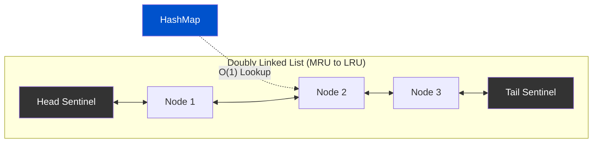

# LRU Cache — Engineered from First Principles

<div align="center">

[](https://isocpp.org/)
[](LICENSE)

**A high-performance, $\mathcal{O}(1)$ Least Recently Used (LRU) Cache built from the ground up in Modern C++ using an `unordered_map` and a custom doubly linked list.**

[Architecture](#️-architecture) • [Engineering Post-Mortem](#-engineering-post-mortem) • [Usage](#-usage)

</div>

---

## 🎯 Overview

This repository is an **engineering case study** in building low-level data structures from first principles. 

Instead of wrapping a standard library list, this project implements a **custom, memory-safe, templated Doubly Linked List**. It utilizes the **Sentinel (Dummy) Node pattern**, achieving zero-branch constant-time pointer surgeries ($\mathcal{O}(1)$) and eradicating the typical null-pointer edge cases that plague cache designs.

### Core Features
- ✅ **Pure $\mathcal{O}(1)$ operations:** Constant-time `get()`, `put()`, and LRU eviction.
- ✅ **Sentinel (Dummy) Node Architecture:** Permanently anchored `head` and `tail` nodes eliminate `if (nullptr)` edge-casing entirely.
- ✅ **Zero-Allocation Node Promotion:** Uses an in-place `Detach()` method to rewire pointers without triggering the `new`/`delete` heap allocator, resolving Use-After-Free vulnerabilities.
- ✅ **Template-driven:** Type-safe for any `K` (Key) and `V` (Value) pairings.
- ✅ **Rule of 5 Compliant:** Prevents shallow-copy double-free memory corruption.

---

## 🏗️ Architecture

The cache operates by coordinating two structures:
1. **`std::unordered_map<K, node<K, V>*>`**: Provides $\mathcal{O}(1)$ lookup from a Key directly to the node's memory address in the linked list.
2. **`linked_list<K, V>`**: A custom doubly-linked list maintaining strict MRU (Most Recently Used) to LRU (Least Recently Used) chronological order.

### The Sentinel Node Invariant
By initializing the list with two dummy nodes (`head` and `tail`), the list is *never* empty from a pointer perspective. Every real node is guaranteed to have a `prev` and a `next`.

This turns complex conditional logic:
```cpp
// Bad: Traditional list removal
if (node->prev) node->prev->next = node->next;
else head = node->next;
if (node->next) node->next->prev = node->prev;
else tail = node->prev;
```
Into a universally true, branch-free, $\mathcal{O}(1)$ operation:
```cpp
// Good: Sentinel node removal
node->prev->next = node->next;
node->next->prev = node->prev;
```

### Visual Flow


---

## 📓 Engineering Post-Mortem

Building a linked data structure from scratch requires confronting memory corruption, segfaults, and topological bugs. Here are the core issues resolved during development:

### 1. Pointer Garbage (`0xC0000005` Access Violation)
**Bug:** C++ stack pointers are not zeroed out by default; they contain garbage memory addresses from previous frames.
**Fix:** Explicitly set pointers `head = nullptr; tail = nullptr;` in the initial single-type implementation, later evolving to instantiate the dummy sentinels in the constructor.

### 2. The Use-After-Free (UAF) Trap
**Bug:** A naive `moveToFront(key)` implementation would `delete` the node and then try to read `temp->key` to re-insert it. This dereferences deallocated memory.
**Fix:** Wrote a pure pointer-surgery method `Detach(node*)` that unhooks the node and wires it behind `head` without ever triggering the heap allocator (`delete` or `new`).

### 3. Branch-Free $\mathcal{O}(1)$ Eviction
**Bug:** Early iteration used `removeLast()` by traversing from head to tail to find the node, resulting in $\mathcal{O}(N)$ eviction.
**Fix:** With the doubly-linked tail sentinel, the LRU element is always accessible precisely at `tail->prev`. Eviction is an instant $\mathcal{O}(1)$ lookup.

---

## 💻 Usage

### Run the Code

The implementation is self-contained in `main.cpp`. It includes the library code and an interactive test suite that demonstrates $\mathcal{O}(1)$ insertion, MRU promotion, and LRU cache eviction.

To compile and run using standard `g++`:

```bash
g++ -std=c++17 main.cpp -o LRU_Cache
./LRU_Cache
```

### API Reference

| Method | Complexity | Description |
|--------|------------|-------------|
| `LRUCache(int capacity)` | $\mathcal{O}(1)$ | Initializes cache and instantiates the underlying sentinel nodes. |
| `get(K key)` | $\mathcal{O}(1)$ | Looks up key in the hash map. If found, detaches and promotes the node to MRU. Returns `node*` or `nullptr`. |
| `put(K key, V value)` | $\mathcal{O}(1)$ | Inserts or updates a key. If capacity is exceeded, evicts the `tail->prev` node instantly. |
| `display()` | $\mathcal{O}(N)$ | Safely traverses the linked list from `head->next` to print the chronological state. |

---

## 📄 License
This project is licensed under the MIT License - see the [LICENSE](LICENSE) file for details.
